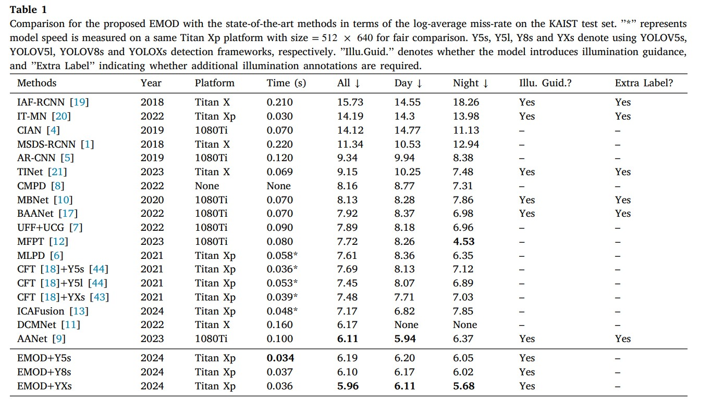
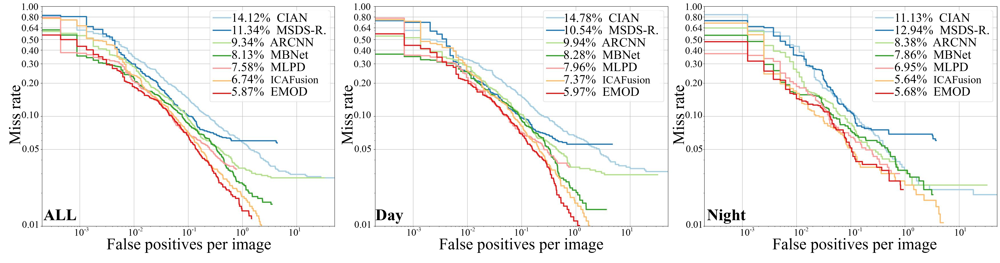

# EMOD
**E**fficient **M**ultispectral **O**bject **D**etection with attentive feature aggregation leveraging zero-shot implicit illumination guidance [(**Information Fusion 2025**)](https://www.sciencedirect.com/science/article/abs/pii/S1566253525000120)



**FPPI**:

To generate the FPPI figure, we utilize the same plotting code in [MPLD](https://github.com/sejong-rcv/MLPD-Multi-Label-Pedestrian-Detection), which yields slightly better results with this Python version code, namely 5.87, 5.97, and 5.68, respectively. 
Results of [ICAFusion](https://github.com/chanchanchan97/ICAFusion) are derived from latest output files provided by its authors.



## Citation

```latex
@article{xiong2025efficient,
  title={Efficient Multispectral Object Detection with attentive feature aggregation leveraging zero-shot implicit illumination guidance},
  author={Xiong, Zhongxia and Yao, Ziying and Liu, Xuan and Zhao, Wenyao and Cao, Jie and Wu, Xinkai},
  journal={Information Fusion},
  pages={102939},
  year={2025},
  publisher={Elsevier}
}
```

